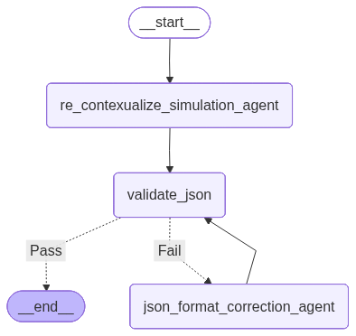
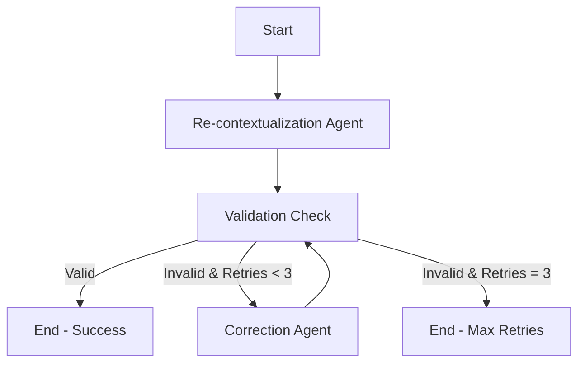

# Simulation Scenario Adapter

## 📋 Overview

This tool automatically transforms educational simulations from one business scenario to another while maintaining their structure and learning objectives. Think of it as a "find and replace on steroids" that intelligently adapts an entire simulation context.

### What Problem Does It Solve?

Imagine you have a well-designed business simulation about a **fast food restaurant responding to a competitor's pricing strategy**. You want to reuse this same simulation structure but apply it to a completely different context - like a **gym responding to a competitor's discount packages**.

Manually rewriting every detail would take hours and risk introducing inconsistencies. This tool automates that transformation in seconds.

---

## 🎯 What This Tool Does

### Input

- **Original Simulation**: A complete business simulation with scenario details, learning outcomes, assessment criteria, roles, and background information
- **Old Scenario**: The current business context (e.g., "Fast Food Restaurant")
- **New Scenario**: The desired business context (e.g., "Fitness Center")

### Output

- **Transformed Simulation**: The same simulation structure, but with all contextual details adapted to the new scenario
- Everything from company names to strategic challenges is intelligently recontextualized
- The structure, data types, and learning framework remain identical

---

## 🔄 How It Works

The tool uses a **multi-agent workflow** with built-in quality control:

```
1. Re-contextualization Agent
   ↓
2. Validation Check
   ↓
3a. If Valid → Done ✓
3b. If Invalid → Correction Agent → Back to Validation
```



### Step-by-Step Process

1. **Re-contextualization Agent**

   - Reads the original simulation JSON
   - Understands the old scenario context
   - Intelligently adapts all narrative content to the new scenario
   - Preserves the technical structure exactly

2. **Validation Check**

   - Ensures the output is valid JSON
   - Verifies all required fields are present
   - Confirms data types match the original structure
   - Checks for any structural inconsistencies

3. **Correction Agent** (if needed)
   - Activates only if validation fails
   - Receives detailed error feedback
   - Makes targeted corrections
   - Re-submits for validation
   - Maximum 3 retry attempts to ensure quality

---

## 📊 Example Transformation

### Before (Fast Food Scenario)

```
Organization: "FreshTaste Restaurant"
Challenge: "Competitor launched a $1 menu"
Role: "Business Consultant advising on pricing strategy"
Manager: "Sarah Chen, Chief Marketing Officer"
```

### After (Fitness Center Scenario)

```
Organization: "FlexFit Gym"
Challenge: "Competitor launched steeply discounted annual packages"
Role: "Business Consultant advising on membership strategy"
Manager: "Mark Caldwell, Chief Strategy Officer"
```

**Everything changes contextually, but the structure remains identical.**

---

## 🛠️ Technical Components

### Core Technologies

- **LangChain**: Framework for building AI agent workflows
- **Google Gemini 2.5 Flash**: AI model that performs the transformation
- **LangGraph**: Orchestrates the multi-agent workflow
- **JSON Schema Validation**: Ensures output quality and consistency

### Workflow Architecture



---

## 📁 File Structure

```
project/
│
├── notebook.ipynb              # Main execution notebook
├── .env                        # API keys (not in version control)
├── problem_statement/
│   └── POC_sim_D.json         # Original simulation data
└── README.md                   # This file
```

---

## 🚀 How to Use

### Prerequisites

1. Python environment with required packages
2. Google Gemini API key
3. Original simulation JSON file

### Setup Steps

1. **Configure Environment**

   ```bash
   # Create .env file with your API key
   GEMINI_API_KEY=your_api_key_here
   ```

2. **Prepare Your Data**

   - Place your simulation JSON in the `problem_statement/` folder
   - Identify which scenario you want to transform to

3. **Run the Notebook**
   - Execute cells sequentially
   - The tool will automatically handle transformation and validation
   - Review the output in `state['generated_schema']`

### Configuration Options

```python
# Select which scenario to transform to
newScenarioOption = scenarioOptions[10]  # Choose your target scenario

# Adjust retry limits if needed
max_retries = 3  # Default is 3 attempts
```

---

## ✅ Quality Assurance

The tool includes multiple safety mechanisms:

- **Structure Preservation**: JSON schema validation ensures the output structure matches the input exactly
- **Format Checking**: Removes markdown artifacts and validates JSON syntax
- **Iterative Correction**: Up to 3 attempts to fix any validation errors
- **Detailed Error Logging**: Tracks all validation attempts and error messages

---

## 📈 Use Cases

### Educational Content Creation

- Adapt case studies to different industries
- Create variations for A/B testing
- Localize content for different markets

### Corporate Training

- Customize simulations for different departments
- Adapt scenarios to company-specific contexts
- Scale content creation across business units

### Curriculum Development

- Create parallel examples for diverse learners
- Maintain consistent learning frameworks across topics
- Rapidly prototype new scenario variations

---

## 🔍 What Gets Changed vs. What Stays the Same

### Changed (Scenario-Dependent)

✏️ Company names and branding  
✏️ Industry-specific terminology  
✏️ Product/service descriptions  
✏️ Character names and roles  
✏️ Market challenges and competitors  
✏️ Strategic context and background

### Unchanged (Structure)

🔒 JSON keys and field names  
🔒 Data types and formats  
🔒 Array structures and nesting  
🔒 Learning outcome frameworks  
🔒 Assessment criteria structure  
🔒 Number of items in arrays

---

## 🎓 Example Output

After transformation, you'll receive a complete simulation JSON like this:

```json
{
  "lessonInformation": {
    "level": "Practice",
    "lesson": "Acting as a consultant, students will develop..."
  },
  "assessmentCriterion": [...],
  "simulationName": "Strategic Consultant: Responding to...",
  "workplaceScenario": {
    "scenario": "FlexFit Gym faces a critical crossroads...",
    "background": {
      "organizationName": "FlexFit Gym",
      "aboutOrganization": "FlexFit Gym, a premium fitness brand..."
    }
  }
}
```

---

## 🐛 Troubleshooting

### Common Issues

**Issue**: JSON Parse Error  
**Solution**: The tool automatically strips markdown formatting. If errors persist, check that the AI model is not adding extra text.

**Issue**: Validation Failed  
**Solution**: The correction agent will attempt fixes automatically. Review `state['history_evaluator']` for detailed error messages.

**Issue**: Retry Limit Exceeded  
**Solution**: Check if the new scenario is too different from the original. You may need to adjust the prompt or choose a more similar scenario.

---

## 📞 Support

For questions or issues:

1. Check the `state['evaluator_message']` for validation details
2. Review `state['history_generator']` to see all transformation attempts
3. Examine the workflow visualization to understand the process flow

---

## 🔐 Security Notes

- Store API keys in `.env` files (never commit to version control)
- Validate all output before using in production
- Review generated content for accuracy and appropriateness
- Keep original simulations as backups

---

## 📝 License & Attribution

This tool leverages:

- Google Gemini AI for intelligent text transformation
- LangChain/LangGraph for workflow orchestration
- Open-source validation libraries

---

**Last Updated**: December 2025  
**Version**: 1.0
