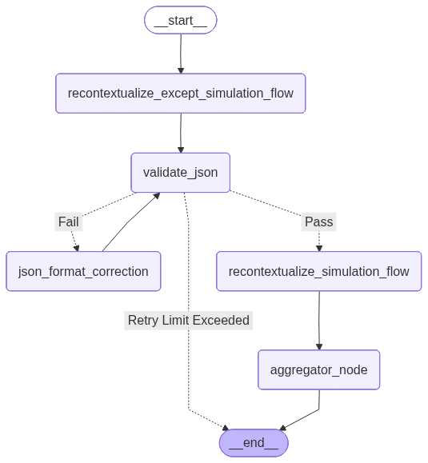
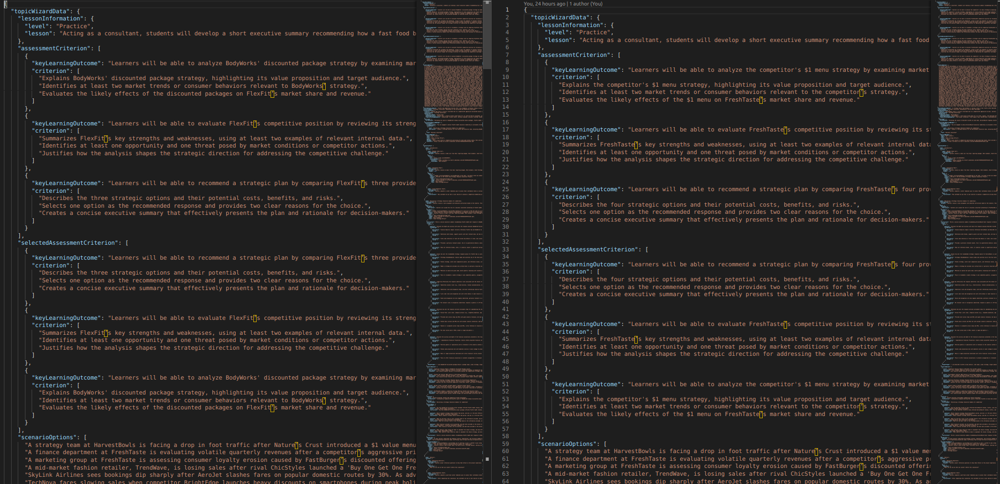

# Scenario-Aware JSON Re-Contextualization Workflow

## Overview

This project implements an **Agentic JSON Re-Contextualization** solution designed to transform an existing simulation JSON document to align with a newly selected scenario while strictly preserving the original data structure.

The system intelligently rewrites narrative content, scenario descriptions, and learning objectives while maintaining schema fidelity and locked critical fields.

## Objective

Take an `input.json` and a `selectedScenario`, then produce an `output.json` that:
- Maintains the **exact structure/schema** of the input
- Adapts all **narrative and content fields** to cohere with the new scenario
- Preserves **locked critical fields** (e.g., `scenarioOptions`)
- Ensures **global coherence** and natural language quality

---

## Architecture: LangGraph Agentic Workflow



The system uses a **graph-based, multi-role agentic workflow** implemented via LangGraph with:
- Conditional steps and verification gates
- Pass/fail routing for error handling
- State sharing across agents
- Configurable retry mechanisms

---

## Key Components

### Agents & Roles

1. **Recontextualization/Generation Agents**
   - Produce rewritten content for scenario-specific fields
   - First agent handles all data except `simulationFlow`
   - Second agent handles `simulationFlow` using context from first step

2. **Verification & Validation Agents**
   - Confirm generated JSON validity and schema compliance
   - If validation fails, `json_format_correction_agent` attempts correction based on error feedback

3. **Aggregator Node**
   - Collects recontextualized pieces
   - Reconstructs final `output.json`
   - Generates validation report
   - Checks schema fidelity, locked-field equality, and runtime statistics

### Guarantees & Constraints

- **Structured Fidelity**: Output has identical schema/shape to input; no keys renamed or deleted
- **Locked Fields**: Critical fields remain unchanged
- **Coherence**: Rewritten content is natural and artifact-free
- **Reliability**: Output guaranteed valid JSON and schema-consistent
- **Configurable Retry**: MAX_RETRIES = 3 for format correction

---

## Installation

### Prerequisites

- Python 3.11
- pip and venv

### Setup Instructions

1. **Clone the repository**
   ```bash
   git clone https://github.com/mohan696matlab/AI_Simulation.git
   cd AI_Simulation
   ```

2. **Create a virtual environment**
   ```bash
   python -m venv venv
   ```

3. **Activate the virtual environment**

   **On Linux/macOS:**
   ```bash
   source venv/bin/activate
   ```

   **On Windows:**
   ```bash
   venv\Scripts\activate
   ```

4. **Install dependencies**
   ```bash
   pip install -r requirements.txt
   ```

5. **Verify installation**
   ```bash
   python -c "import langchain; print('LangChain installed successfully')"
   ```

---

## Usage

### Basic Command

Execute the re-contextualization pipeline via CLI:

```bash
python recontexualize.py \
  --input_json problem_statement/POC_sim_D.json \
  --current_scenario "A strategy team at HarvestBowls is facing a drop in foot traffic..." \
  --new_scenario "FlexFit Gym memberships decline after rival BodyWorks introduces discounted packages..." \
  --output_dir results
```

### Command-Line Arguments

| Argument | Description |
|----------|-------------|
| `--input_json` | Path to the source JSON file |
| `--current_scenario` | Description of the scenario currently active in the JSON |
| `--new_scenario` | Description of the target scenario for re-contextualization |
| `--output_dir` | Directory where results will be saved (default: `results`) |

---

## Deliverables

Upon successful completion, the system saves the following files to the specified output directory:



| File | Purpose |
|------|---------|
| `output.json` | The re-contextualized JSON document with all adaptations |
| `changed_fields.json` | Summary of fields modified during the process |
| `validation_report.json` | Detailed validation and schema compliance report |

---

## Project Structure

```
AI_Simulation/
├── README.md                          # This file
├── requirements.txt                   # Python dependencies
├── recontexualize.py                  # Main execution script
├── utlis.py                           # Utility functions
├── workflow.ipynb                     # Jupyter notebook for exploration
├── problem_statement/
│   ├── POC_sim_D.json                 # Sample input JSON
│   └── poc.md                         # Problem context
├── results/                           # Output directory
│   ├── output.json                    # Re-contextualized JSON
│   └── changed_fields.json            # Change summary
└── assets/                            # Images and diagrams

```

---

## Development Notes
- Create a `.env` file to store `GEMINI_API_KEY`
- Jupyter notebook (`workflow.ipynb`) available for interactivity
- `requirements.txt` lists essential Python packages
- Check `changed_fields.json` to understand which fields were modified
